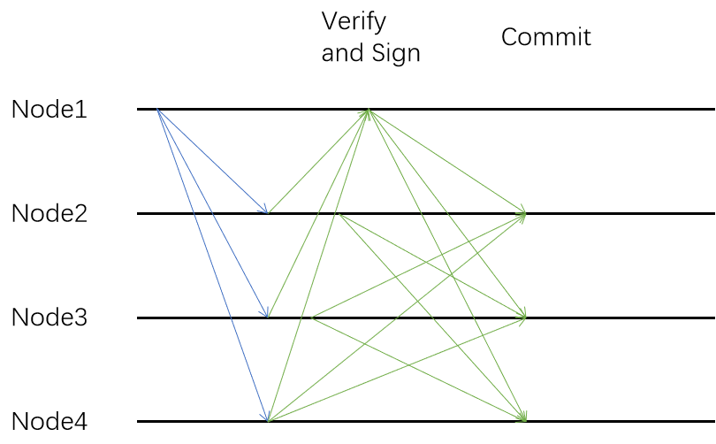

# Bytom2.0 共识算法介绍

## 术语

Epoch：一个Epoch以一定的区块数（例如100个）来记数，在同一个Epoch下验证者节点是固定的，下一个Epoch会根据上一个Epoch投票情况产生新的验证者。

Checkpoint：共识算法不会处理链中的所有区块，而是以Checkpoint为单位来验证，一般情况下以一个Epoch的区块数作为一个Checkpoint。

Justified：一个Checkpoint在收到一次2/3确认（按照节点数量还是抵押的数量）后状态为justified，justified的节点可能会被推翻。

Finalized：一个已经justified的Checkpoint c的子节点被justified后，则Checkpoint c转化为finalized，具有finalized的checkpoint不可被推翻。

## 为什么我们需要升级Bytom2.0共识

Vapor也采用了和Bytom2.0一样的DPoS+BFT算法，且稳定运行了较长时间，并承载了很多应用，但同时也发现存在以下问题：

在高速出块的情况下，每个区块都要进行2/3的签名确认将占用大量的网络带宽。
0.5秒出块使得链上数据占用的磁盘空间急剧膨胀；容易导致分叉（一个节点在未收到上一个节点出块的情况下继续出块）；此外，也给一些钱包、浏览器（需要同步区块）造成了一些性能上的瓶颈。
共识算法未经过有效的安全性验证，传统的BFT算法一般都需要两次确认。

Bytom2.0 对共识进行了升级，以解决上述的几个问题：

- 采用Checkpoint为单位
- 来进行验证和签名，大大减少了签名确认所占用的网络带宽
- 将0.5s一个块延长为6s一个块，降低分叉概率
- 对每个Checkpoint进行两次确认，第一次为Justified状态，第二次才进入最终确认Finalized状态

Bytom2.0升级后，在以下多个方面可以获得较大提升：

- 节约能源
- 更好的性能提升
- 更好的经济安全性
- 更强的扩展性

## 共识过程

1、在Bytom2.0链刚启动时，由创世节点负责出块。此时其他节点可进行抵押BTM来成为共识节点，普通参与者可对共识节点进行投票。
2、每个投票和选举轮次称为一个Epoch，一个Epoch包含一组区块（比如100个），在该Epoch中共识节点是固定的，下一个Epoch开始根据投票数量重新选举共识节点。
3、当下一个Epoch检测到有合法的共识节点达到一定个数时，创世节点停止出块，由共识节点出块。
4、从当前Epoch开始，每隔6秒出1个块，每个共识节点按照票数排序轮流进行出块。
5、Bytom2.0 不会对每个区块进行验证，而是采用Checkpoint为单位来处理，一般情况下以一个Epoch的区块数作为一个Checkpoint。
6、Bytom2.0 会对每个Checkpoint进行两次确认，一次是Checkpoint在收到2/3确认后状态为Justified，此时还可被推翻，而等到其子节点也被确认为Justified状态后，获得二次确认并获得Finalized状态，此时获得最终确认且不能被推翻。
7、为了防止无利害攻击，Bytom2.0会对同时进行同一高度的两个区块签名的共识节点进行惩罚，罚没其抵押的部分BTM，考虑到这部分的复杂性，Bytom2.0会在共识稳定后逐步引入该机制

### 选举和出块过程

### CheckPoint验证

每个Checkpoint会经过一轮共识节点的验证和签名，当获得超过2/3的签名后，Checkpoint会得到一次确认，并设置为Justified。

### 状态转换

如下图所示，黄色粗箭头存在一条 link，从某一个source checkpoint到target checkpoint，如果该link得到 2/3  签名，target 变成 justified。 如果source是他的直接父节点才会变成finalized，出块会跟随具有最大高度justified checkpoint的链。

## 小结

Bytom2.0的共识算法，是基于Vapor共识算法的经验和教训，同时吸收了ETH Casper的相关设计理念，但对于其复杂的部分又进行了优化，推出的适合于比原链自身的一种创新共识。

Bytom2.0的共识算法，在节能，性能，对抗攻击能力和扩展性等方面都具有优势，共识算法作为区块链底层最重要的基础协议，必将在Bytom2.0上发挥巨大的价值。
